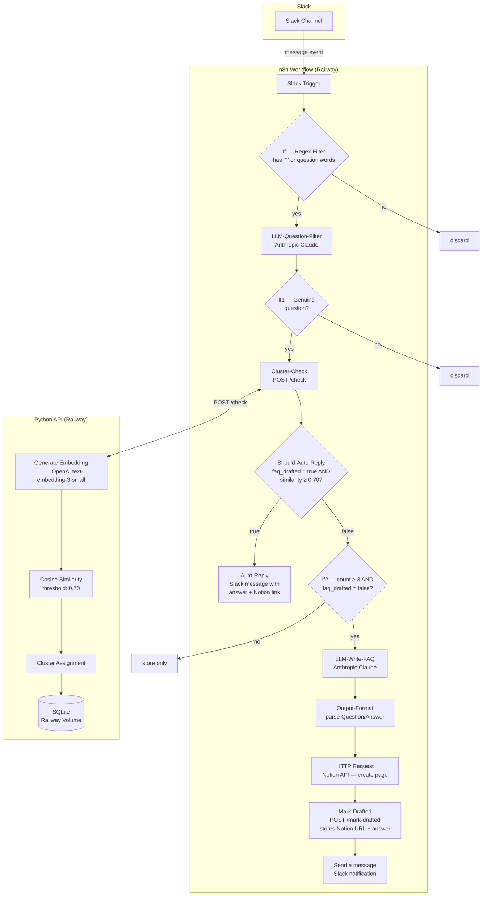

# Automated Slack FAQ

**Automatic FAQ generation from repeated Slack questions using semantic similarity clustering, with auto-reply for previously answered questions.**

> 📚 Portfolio project demonstrating knowledge management automation, embedding-based clustering, and cross-platform integration (Slack → API → Notion).

## Problem Statement

In active Slack communities, the same questions get asked repeatedly by different people. This creates:
- **Information fragmentation** - answers scattered across threads
- **Duplicated effort** - team members answering the same questions
- **Poor discoverability** - no central FAQ or knowledge base

## Solution

An automated system that:
1. **Monitors** incoming Slack messages
2. **Clusters** semantically similar questions using embeddings
3. **Triggers** FAQ draft creation when a question is asked 3+ times
4. **Routes** drafts to Notion for review and publication
5. **Auto-replies** in Slack when a new question matches an existing FAQ with high confidence

## Architecture



## Key Design Decisions

### 1. Two-Stage Question Filtering
- **Stage 1 (Regex):** Fast pattern matching for obvious questions (`?` or question words like "how", "what", "where")
- **Stage 2 (LLM - Anthropic Claude):** Semantic analysis to filter out:
  - Rhetorical questions ("Why is this so hard???")
  - Greetings ("How are you?")
  - Time-sensitive queries ("What time is the meeting?")
  - Vague requests ("Can someone help me?")
- **Why:** Reduces API costs by filtering majority of non-questions with cheap regex before using LLM
- **Trade-off:** Adds ~1-2 seconds latency per message, but ensures only genuine FAQ-worthy questions are clustered

### 2. LLM Choice: Anthropic Claude vs OpenAI GPT
- **Why Claude:** More reliable at following strict formatting instructions (Question: / Answer: structure)
- **Experience:** OpenAI models (GPT-4o-mini, GPT-3.5-turbo) produced inconsistent or empty outputs with structured prompts (I suspect this was an issue with the n8n node, but didn't investigate further).
- **Use cases:** Claude handles both question filtering and FAQ draft generation

### 3. Embedding Model: OpenAI `text-embedding-3-small`
- **Why:** Good balance of performance (1536 dimensions) and cost ($0.02 per 1M tokens)
- **Alternatives considered:** `text-embedding-3-large` (higher accuracy but 3x cost)

### 4. Similarity Metric: Cosine Similarity
- **Why:** Standard for embedding comparison, robust to question length variations
- **Threshold:** 0.70 (empirically tuned, see [TUNING_LOG.md](TUNING_LOG.md))
- **Rationale:** ≥ 0.70 = paraphrases (clustered), 0.55–0.70 = related but different questions (not clustered), < 0.55 = unrelated (not clustered). Threshold was baselined against a small subset of common IT and HR questions — may need adjustment for other domains

### 5. Auto-Reply Threshold
- **Threshold:** 0.70 similarity AND `faq_drafted = true`
- **Why:** Only replies when a question closely matches a cluster that already has a published FAQ
- **Behavior:** Posts the stored FAQ answer and a link to the Notion article directly in the Slack channel
- **What it doesn't catch:** Off-topic questions (e.g. "How do I use a car?") never cluster with existing FAQs due to low similarity, so they never trigger an auto-reply

### 6. Clustering Logic: Incremental
- **Why:** Real-time clustering as questions arrive (vs. batch processing)
- **Trade-off:** Simpler to implement, but doesn't handle cluster merging or splitting

### 7. Storage: SQLite on Railway Volume
- **Why:** Simple, serverless-friendly, sufficient for moderate scale (<10K questions)
- **Limitations:** No built-in vector search (could migrate to PostgreSQL with pgvector for larger scale)

### 8. FAQ Trigger Threshold: 3 occurrences
- **Why:** Balances noise reduction (not every question) with timeliness (catches real patterns quickly)
- **Draft Prevention:** After first FAQ is created, cluster is marked `faq_drafted: true` to prevent duplicates
- **Configurable:** Can be adjusted based on channel activity

## API Endpoints

| Method | Endpoint | Purpose | Status |
|--------|----------|---------|--------|
| `GET` | `/` | Service info | ✅ Live |
| `GET` | `/health` | Health check | ✅ Live |
| `POST` | `/check` | Cluster a new question | ✅ Live |
| `GET` | `/clusters` | List all clusters | ✅ Live |
| `POST` | `/clusters/{id}/mark-drafted` | Mark FAQ as drafted, store Notion URL + answer | ✅ Live |
| `GET` | `/questions` | List all stored questions | 🔒 Requires API key |
| `POST` | `/migrate` | Run schema migrations | 🔒 Requires API key |
| `POST` | `/reset` | Clear database (testing only) | 🔒 Requires API key |
| `POST` | `/debug` | Inspect similarity scores | 🔒 Requires API key |

### Example: Check a Question
```bash
curl -X POST http://localhost:8000/check \
  -H "Content-Type: application/json" \
  -d '{
    "text": "How do I reset my password?",
    "source_channel": "C12345",
    "source_user": "U67890"
  }'
```

Response:
```json
{
  "status": "matched",
  "cluster_id": 6,
  "cluster_count": 3,
  "similar_questions": [
    "How do I reset my password?",
    "Where do I change my password?",
    "I forgot my password, how do I get a new one?"
  ],
  "faq_drafted": true,
  "faq_url": "https://www.notion.so/How-do-I-reset-my-password-abc123",
  "faq_answer": "Reset your password through Okta at company.okta.com, or ask IT in #it-help.",
  "similarity_score": 0.91
}
```

### Example: Mark a Cluster as Drafted
```bash
curl -X POST http://localhost:8000/clusters/6/mark-drafted \
  -H "Content-Type: application/json" \
  -d '{
    "notion_url": "https://www.notion.so/How-do-I-reset-my-password-abc123",
    "answer": "Reset your password through Okta at company.okta.com, or ask IT in #it-help."
  }'
```

## Deployment

### Stack
- **API:** FastAPI (Python 3.11)
- **Hosting:** Railway (Docker)
- **Database:** SQLite (volume-mounted at `/data`)
- **Workflow:** n8n (also on Railway)
- **LLM:** Anthropic Claude (question filtering + FAQ drafting)
- **Embeddings:** OpenAI text-embedding-3-small

### Environment Variables

**Python API Service:**
| Variable | Description |
|----------|-------------|
| `OPENAI_API_KEY` | OpenAI API key for embeddings |
| `DB_PATH` | Database file path (default: `/data/questions.db`) |
| `PORT` | Auto-assigned by Railway |
| `ADMIN_API_KEY` | API key for protected endpoints (`/reset`, `/debug`, `/questions`, `/migrate`) |

**n8n Service:**
| Variable | Description |
|----------|-------------|
| `ANTHROPIC_API_KEY` | Anthropic API key for Claude LLM nodes |
| `SLACK_BOT_TOKEN` | Slack bot token for event subscriptions |
| `NOTION_API_KEY` | Notion integration token |

### Local Development
```bash
# Create virtual environment
python3 -m venv .venv
source .venv/bin/activate

# Install dependencies
pip install -r requirements.txt

# Set environment variables
export OPENAI_API_KEY="sk-..."
export DB_PATH="./questions.db"

# Run server
uvicorn main:app --reload --port 8000
```

## Why a Separate Python API?

n8n's built-in Data Tables could handle storage and eliminate the Python service entirely. I evaluated this approach and chose a dedicated API instead:

| Consideration | Python API (chosen) | n8n Data Tables |
|---------------|---------------------|-----------------|
| **Performance** | Fast — numpy vectorizes cosine similarity across 1536-dimension embeddings | Slow — JavaScript loops over every stored question |
| **Testability** | High — `/check`, `/debug`, `/clusters` endpoints are independently testable | Low — logic buried in Code nodes, only testable through full workflow runs |
| **Reusability** | Any client can call the API (Discord bot, CLI tool, web dashboard) | Locked to n8n |
| **Scalability** | Can migrate to PostgreSQL + pgvector without touching the workflow | Hits a ceiling around 1000 questions |
| **Deployment** | Two services to maintain | One service |
| **Complexity** | Higher (separate repo, Dockerfile, Railway service) | Lower (everything in n8n) |

For small-scale personal use (<100 questions), the n8n-only approach is viable and simpler. This project uses a dedicated API because the clustering logic benefits from Python's numerical libraries, and the clean API boundary makes the system easier to test, debug, and extend.

## Limitations & Future Work

### Current Limitations
1. **No cluster merging** - If similar questions are added before threshold is reached, they may form separate clusters
2. **No multi-language support** - Embeddings are English-optimized
3. **No user deduplication** - Same exact question from same user can inflate cluster count
4. **Basic auth only** - Protected endpoints use a single API key (no role-based access)
5. **LLM filtering adds latency** - ~1-2 seconds per message for Claude API call
6. **n8n Notion node incompatibility** - n8n's built-in Notion node hasn't been updated for the Notion API 2025-09-03 version. Worked around this by using an HTTP Request node that calls the Notion API directly
7. **No input sanitization** - Special characters in Slack messages (quotes, backslashes) can break JSON body in n8n Cluster-Check node

### Potential Enhancements
- [ ] Add user deduplication (don't count same user asking same question twice)
- [ ] Implement cluster merging (periodic job to merge high-similarity clusters)
- [ ] Migrate to PostgreSQL with pgvector for better vector search
- [ ] Add analytics dashboard (cluster trends, top questions, response times)
- [ ] Support multi-language questions (use multilingual embedding models)
- [ ] Add feedback loop (mark drafted FAQs as "helpful" or "not helpful")
- [ ] Cache LLM filter results to reduce API costs for repeated message patterns
- [ ] Add confidence scores to LLM filter (not just yes/no, but 0-100% confidence)
- [ ] Sanitize input text in n8n Cluster-Check node (escape special characters that break JSON body)

## n8n Workflow

A sanitized export of the n8n workflow is included at [`n8n-workflow.json`](n8n-workflow.json). To use it:

1. Import the JSON file into your n8n instance
2. Replace placeholder values:
   - `YOUR_API_URL` — in the Cluster-Check and Mark-Drafted nodes
   - `YOUR_SLACK_CHANNEL_ID` — in the Slack Trigger, Auto-Reply, and Send a message nodes
   - `YOUR_NOTION_DATABASE_ID` — in the HTTP Request (Notion) node
3. Add your credentials for Slack, Anthropic, and Notion

### Workflow Nodes

| Node | Type | Purpose |
|------|------|---------|
| **Slack Trigger** | Trigger | Listens for messages in a Slack channel |
| **If** | IF | Regex filter — has `?` or question words |
| **LLM-Question-Filter** | LLM Chain | Claude determines if message is a genuine question |
| **lf1** | IF | Checks if Claude responded "yes" |
| **Cluster-Check** | HTTP Request | POST /check to clustering API |
| **Should-Auto-Reply** | IF | Checks `faq_drafted = true` AND `similarity_score ≥ 0.70` |
| **Auto-Reply** | Slack | Posts FAQ answer + Notion link in channel |
| **lf2** | IF | Checks `cluster_count ≥ 3` AND `faq_drafted = false` |
| **LLM-Write-FAQ** | LLM Chain | Claude drafts a FAQ entry from clustered questions |
| **Output-Format** | Code | Parses Question/Answer from LLM output |
| **HTTP Request** | HTTP Request | Creates page in Notion database |
| **Mark-Drafted** | HTTP Request | POST /mark-drafted with Notion URL + answer |
| **Send a message** | Slack | Notifies channel that a new FAQ draft was created |

## Testing

See [TUNING_LOG.md](TUNING_LOG.md) for threshold calibration methodology.

### Run Tests Locally
```bash
# Run automated tests
python -m pytest test_auto_reply.py -v

# Reset database
curl -X POST http://localhost:8000/reset \
  -H "X-Api-Key: YOUR_KEY"

# Add questions and verify clustering
curl -X POST http://localhost:8000/check \
  -H "Content-Type: application/json" \
  -d '{"text": "How do I reset my password?"}'

# Check similarity scores
curl -X POST http://localhost:8000/debug \
  -H "Content-Type: application/json" \
  -H "X-Api-Key: YOUR_KEY" \
  -d '{"text": "Where do I change my password?"}'
```

## License

MIT License - see [LICENSE](LICENSE) for details.
